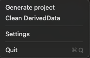
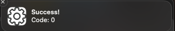

# lazylauncher

This small tool provides an easy and lazy way to launch any CLI tools for MacOSX via a few mouse clicks.

## About

The utility is written in Swift. It has no third-party dependencies and uses SwiftUI for most layouts (if you wonder how it works).
The app lives in top bar and provides a simple dropdown menu that you can customize via the Settings window.

## Use cases

I developed this tool for launching CLI tools, like generating projects for Xcode via xcodegen, but you can put them there every you want.

For example, you want to launch a script or line from Makefile, that contains generate project command and cocoapods install stage(actual for iOS-developers).
- Open Settings
- Choose your sh(`bash` of `zsh`)
- Toggle flags which you need(`-l`,`-c`,`-i`). In this case, I toggle on all of them.
- Put your command in textfield(like

`( export LANG=en_US.UTF-8 && cd ~/Projects/MyAwesomeProject && make project )`,

where `export LANG=en_US.UTF-8` uses for cocoapods `pod install` command works properly
and `make project` command from Makefile which includes generate the project and `pod install` synchronously.
- Optionally, you can describe a custom success message, like "Project generated successfully!"
- Tap "Save"
- Close the Settings

Now in the dropdown menu, you will see the just created command. If you granted push notification on launch, when you launch the command you should see a notification that represents your result.

## Features

- Launch any command that you can launch in your zsh or bash enviroment.
- Local notifications
- See last launched logs for command(failures should show immediately).

# Stack

The app under the hood uses SwiftUI for layout, which gives me some experience for development for MacOSX. But few things I guess I can write better. I open to any feedback.
